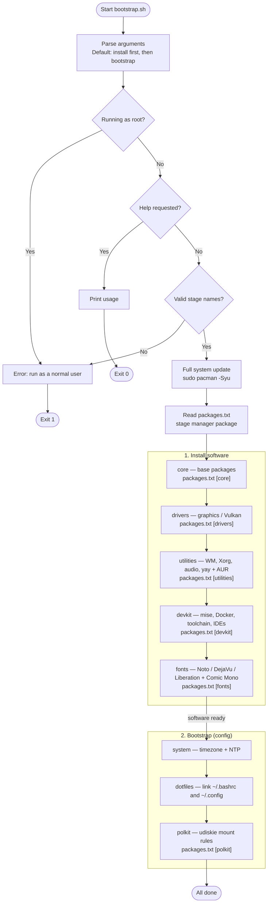

```mermaid
flowchart TD
    START([Start bootstrap.sh]) --> ARGS["Parse arguments<br/>Default: install first, then bootstrap"]
    ARGS --> ROOT{Running as root?}
    ROOT -->|Yes| ERR["Error: run as a normal user"]
    ROOT -->|No| HELP{Help requested?}
    HELP -->|Yes| USAGE["Print usage"]
    USAGE --> EXIT0([Exit 0])
    HELP -->|No| VALID{Valid stage names?}
    VALID -->|No| ERR
    VALID -->|Yes| UPDATE["Full system update<br/>sudo pacman -Syu"]

    UPDATE --> PKG["Read packages.txt<br/>stage manager package"]
    PKG --> CORE

    subgraph INSTALL["1. Install software"]
        direction TB
        CORE["core — base packages<br/>packages.txt [core]"]
        DRIVERS["drivers — graphics / Vulkan<br/>packages.txt [drivers]"]
        UTILITIES["utilities — WM, Xorg, audio, yay + AUR<br/>packages.txt [utilities]"]
        DEVKIT["devkit — mise, Docker, toolchain, IDEs<br/>packages.txt [devkit]"]
        FONTS["fonts — Noto / DejaVu / Liberation + Comic Mono<br/>packages.txt [fonts]"]
        CORE --> DRIVERS --> UTILITIES --> DEVKIT --> FONTS
    end

    FONTS -->|"software ready"| SYSTEM

    subgraph BOOTSTRAP["2. Bootstrap (config)"]
        direction TB
        SYSTEM["system — timezone + NTP"]
        DOTFILES["dotfiles — link ~/.bashrc and ~/.config"]
        POLKIT["polkit — udiskie mount rules<br/>packages.txt [polkit]"]
        SYSTEM --> DOTFILES --> POLKIT
    end

    POLKIT --> DONE([All done])
    ERR --> EXIT1([Exit 1])
```
