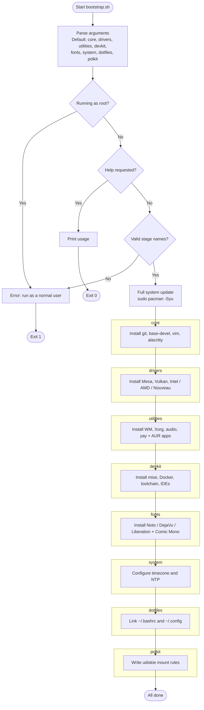

```mermaid
flowchart TD
    START([Start bootstrap.sh]) --> ARGS["Parse arguments<br/>Default: core, drivers, utilities, devkit,<br/>fonts, system, dotfiles, polkit"]
    ARGS --> ROOT{Running as root?}
    ROOT -->|Yes| ERR["Error: run as a normal user"]
    ROOT -->|No| HELP{Help requested?}
    HELP -->|Yes| USAGE["Print usage"]
    USAGE --> EXIT0([Exit 0])
    HELP -->|No| VALID{Valid stage names?}
    VALID -->|No| ERR
    VALID -->|Yes| UPDATE["Full system update<br/>sudo pacman -Syu"]

    subgraph CORE["core"]
        C1["Install git, base-devel, vim, alacritty"]
    end
    subgraph DRIVERS["drivers"]
        D1["Install Mesa, Vulkan, Intel / AMD / Nouveau"]
    end
    subgraph UTILITIES["utilities"]
        U1["Install WM, Xorg, audio, yay + AUR apps"]
    end
    subgraph DEVKIT["devkit"]
        K1["Install mise, Docker, toolchain, IDEs"]
    end
    subgraph FONTS["fonts"]
        F1["Install Noto / DejaVu / Liberation + Comic Mono"]
    end
    subgraph SYSTEM["system"]
        S1["Configure timezone and NTP"]
    end
    subgraph DOTFILES["dotfiles"]
        DF1["Link ~/.bashrc and ~/.config"]
    end
    subgraph POLKIT["polkit"]
        P1["Write udiskie mount rules"]
    end

    UPDATE --> C1
    C1 --> D1 --> U1 --> K1 --> F1 --> S1 --> DF1 --> P1
    P1 --> DONE([All done])
    ERR --> EXIT1([Exit 1])
```
