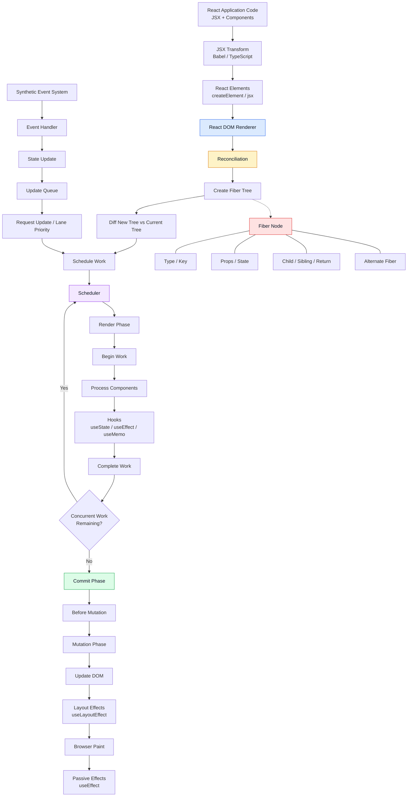

```mermaid
flowchart TD
    A["React Application Code<br/>JSX + Components"] --> B["JSX Transform<br/>Babel / TypeScript"]
    B --> C["React Elements<br/>createElement / jsx"]

    C --> D["React DOM Renderer"]

    D --> E["Reconciliation"]
    E --> F["Create Fiber Tree"]
    F --> G["Diff New Tree vs Current Tree"]
    G --> H["Schedule Work"]

    H --> I["Scheduler"]
    I --> J["Render Phase"]

    J --> K["Begin Work"]
    K --> L["Process Components"]
    L --> M["Hooks<br/>useState / useEffect / useMemo"]
    M --> N["Complete Work"]

    N --> O{"Concurrent Work<br/>Remaining?"}
    O -->|Yes| I
    O -->|No| P["Commit Phase"]

    P --> Q["Before Mutation"]
    Q --> R["Mutation Phase"]
    R --> S["Update DOM"]
    S --> T["Layout Effects<br/>useLayoutEffect"]
    T --> U["Browser Paint"]
    U --> V["Passive Effects<br/>useEffect"]

    W["State Update"] --> X["Update Queue"]
    X --> Y["Request Update / Lane Priority"]
    Y --> H

    Z["Synthetic Event System"] --> AA["Event Handler"]
    AA --> W

    AB["Fiber Node"] --- AC["Type / Key"]
    AB --- AD["Props / State"]
    AB --- AE["Child / Sibling / Return"]
    AB --- AF["Alternate Fiber"]

    F -.-> AB

    style D fill:#dbeafe,stroke:#2563eb,color:#111827
    style E fill:#fef3c7,stroke:#d97706,color:#111827
    style I fill:#f3e8ff,stroke:#9333ea,color:#111827
    style P fill:#dcfce7,stroke:#16a34a,color:#111827
    style AB fill:#fee2e2,stroke:#dc2626,color:#111827
```
## Sources: 
* [Render and commit](https://react.dev/learn/render-and-commit)
* [React fiber](https://blog.logrocket.com/deep-dive-react-fiber)
* 